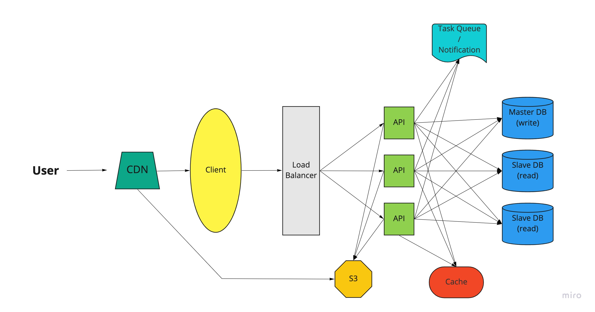

# Масштабирование приложения

Примерная схема масштабированного приложения календаря:

1. Само приложение у нас stateless, так что мы без проблем можем сделать столько его инстансов, сколько необходимо для текущей нагрузки.
2. Над инстансами API мы можем поставить балансировщик для адекватного распределения нагрузки.
3. Есть предположение, что операций на чтение будет сильно больше, чем операций на изменение базы данных, так что мы можем реплицировать базу данных, создав столько read-slave инстансов, сколько необходимо.
4. На определенном этапе можно сделать шардинг, отделив таблицу Event в отдельный инстанс, так как с ней явно будет происходить сильно больше операций изменения, чем с остальными таблицами. Но это шаг, который должен применяться с умом и только тогда, когда это действительно необходимо. До определенного этапа вертикальное масштабирование и реплицирование базы данных должны хорошо работать.
5. Нам также понадобится слой кэша. Мы можем кэшировать информацию о пользователе, о встречах, о встречах в интервале (так как это затратная по вычислениям операция), сбрасывая кэш тогда, когда это необходимо.
6. Также нам понадобится очередь задач для реализации уведомлений. Хотя я бы на самом деле реализовала сервис нотификаций как отдельный сервис, исходя из концепции микросервисной архитектуры, так как сам по себе этот функционал слабо связан с функционалом календаря. Также в отдельный сервис, на мой взгляд, можно выделить сервис аутентификации пользователя.
7. Еще мы можем добавить слой хранения S3, чтобы хранить файлы, которые добавляются к встречам, как в Google-календаре.
8. Кроме того, можно добавить CDN для более быстрой доставки статики клиента и файлов из S3.
